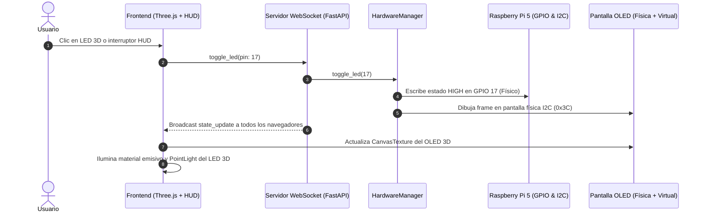

# 📖 Guía Paso a Paso: Gemelo Digital 3D & Control IoT con Raspberry Pi 5

Bienvenido a la guía instructiva interactiva del sistema de control y monitoreo en tiempo real para la **Freenove Breakout Board** y **Raspberry Pi 5** utilizando **Three.js** y **WebSockets**.

---

## 🖼️ Vista General del Sistema

El proyecto conecta la placa física con un gemelo virtual 3D de alta fidelidad:




---

## 🛠️ Paso 1: Conexión del Hardware

Inserta la **Freenove Breakout Board** sobre el cabezal de 40 pines de la Raspberry Pi 5 asegurando que todos los pines queden alineados.


### 🔌 Conexión de la Pantalla OLED (SSD1306 / SH1106)
Conecta los 4 cables hembra-hembra desde la pantalla OLED a los terminales de tornillo correspondientes:

| Pin OLED | Terminal Breakout | Pin Físico RPi 5 | Explicación |
| :--- | :--- | :--- | :--- |
| **GND** | **`GND`** | Pin 6 | Tierra común de alimentación |
| **VCC** / **VDD** | **`+3V3`** | Pin 1 | Alimentación de 3.3V *(¡No usar 5V!)* |
| **SCL** / **SCK** | **`SCL1`** | Pin 5 (GPIO 3) | Línea de reloj del bus I2C |
| **SDA** | **`SDA1`** | Pin 3 (GPIO 2) | Línea de datos del bus I2C |

> [!IMPORTANT]
> Verifica siempre la serigrafía impresa en el módulo OLED. Algunos módulos tienen `GND-VCC-SCL-SDA` y otros `VCC-GND-SCL-SDA`. Invertir GND y VCC puede impedir el encendido o dañar el módulo.

---

## ⚙️ Paso 2: Iniciar el Servidor Backend en la Raspberry Pi

1. **Abre una terminal en tu Raspberry Pi (`admin@JosartaPi5`):**
   ```bash
   cd ~/webled/backend
   ```

2. **Inicia el servidor:**
   ```bash
   python3 app.py
   # O ejecuta: ./run.sh
   ```

3. **Verás en la consola:**
   ```text
   🟢 [HW] 28 Pines GPIO físicos inicializados correctamente.
   🟢 [HW] Pantalla OLED SSD1306 física detectada en Bus 1, Dirección 0x3c.
   🚀 Servidor IoT Raspberry Pi corriendo
   👉 API REST:     http://localhost:8000/api/status
   👉 WebSockets:   http://localhost:8000/socket.io/
   ```

4. **Obtén la IP de tu Raspberry Pi:**
   ```bash
   hostname -I
   ```
   *(Ejemplo de salida: `192.168.1.45`)*.

---

## 🌐 Paso 3: Abrir la Interfaz Web 3D en tu PC

1. **En tu PC, abre una terminal en la carpeta del frontend:**
   ```powershell
   cd "D:\Proyectos IA\RaspberryPi's\webled\frontend"
   npm run dev
   ```

2. **Abre el navegador web e ingresa a:**
   👉 **`http://localhost:5173`**

3. **Enlazar con la Raspberry Pi:**
   - En el panel superior izquierdo verás la barra:
     `[ IP Pi ej: 192.168.1.50 ] [ CONECTAR ]`
   - Escribe la dirección IP de tu Raspberry Pi (ej. `192.168.1.45` o `JosartaPi5.local`) y haz clic en **`CONECTAR`**.
   - El indicador superior cambiará inmediatamente a 🟢 **`ONLINE`** / **`PHYSICAL (GPIO+OLED)`**.

---

## 🕹️ Paso 4: Cómo Funciona la Interacción en Vivo

```
 ┌────────────────────────────────────────────────────────────────────────┐
 │                              ESCENA 3D                                 │
 │                                                                        │
 │   1. Clic Izquierdo + Arrastrar:  Orbita y rota la placa 3D            │
 │   2. Rueda del Mouse (Scroll):   Zoom in / Zoom out con amortiguación  │
 │   3. Clic sobre cualquier LED:   Conmuta el GPIO físico en tiempo real │
 │   4. Pantalla OLED 3D:           Muestra IP, CPU%, Temp°C y logs       │
 └────────────────────────────────────────────────────────────────────────┘
```

### Funcionalidades del Panel HUD (2D Glassmorphism)

1. **Botones Globales:**
   - **`⚡ ALL ON`**: Enciende instantáneamente todos los 28 LEDs físicos y virtuales.
   - **`🌑 ALL OFF`**: Apaga todos los pines GPIO.
2. **Matriz de Terminales:**
   - Cada uno de los 40 terminales cuenta con su etiqueta BCM (ej. `IO17`, `IO27`, `SDA1`), número de pin físico y su botón individual `ON / OFF`.
3. **Espejo OLED & Telemetría:**
   - El recuadro superior derecho muestra en 128x64 píxeles la réplica exacta de lo que dibuja la pantalla física conectada por I2C.
   - Gráficos de barra y valores en tiempo real de **CPU**, **Temperatura del SoC**, **Memoria RAM** e **IP Local**.
4. **Feed de Logs:**
   - Registra cada evento con marca de tiempo precisa: `[20:18:43] IO17 -> ON`.

---

## ❓ Preguntas Frecuentes & Diagnóstico

> [!TIP]
> **¿La pantalla OLED no muestra texto pero los LEDs sí conmutan?**
> Ejecuta en la Raspberry Pi `i2cdetect -y 1`. Si no ves `3c` o `3d`, intercambia los cables SDA y SCL, o verifica que la línea de alimentación esté firmemente en **`+3V3`**.

> [!NOTE]
> **¿Puedo abrir la interfaz desde mi teléfono o tablet?**
> Sí. Conectado a la misma red WiFi, abre en el navegador de tu móvil `http://<IP_DE_TU_PC>:5173` y podrás controlar los LEDs táctilmente.

